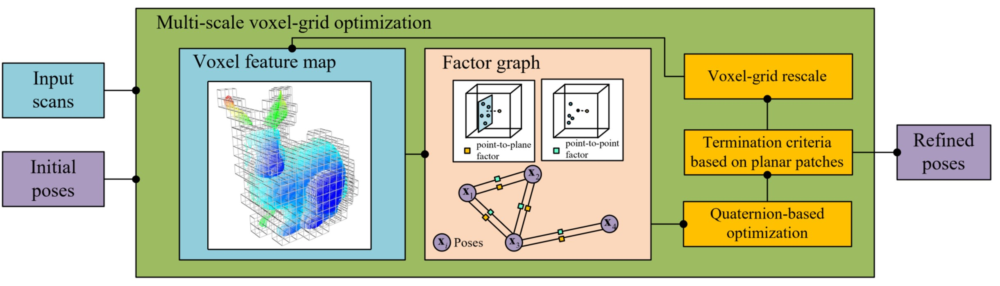
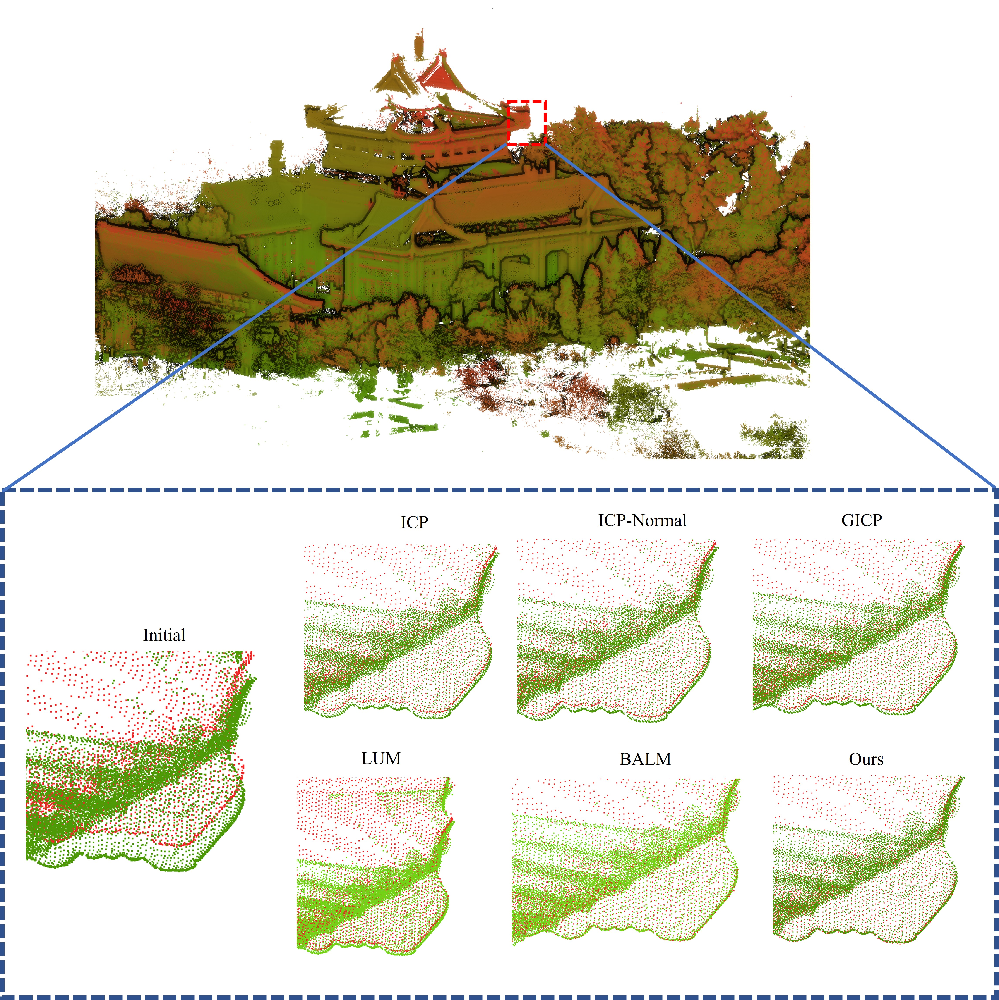
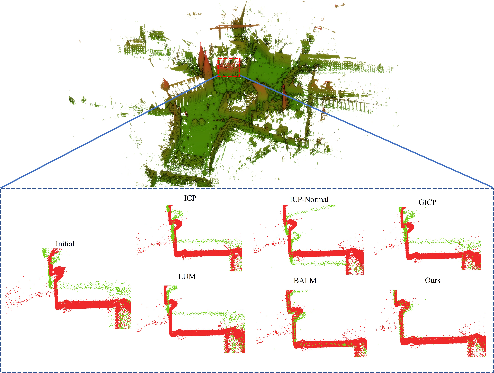
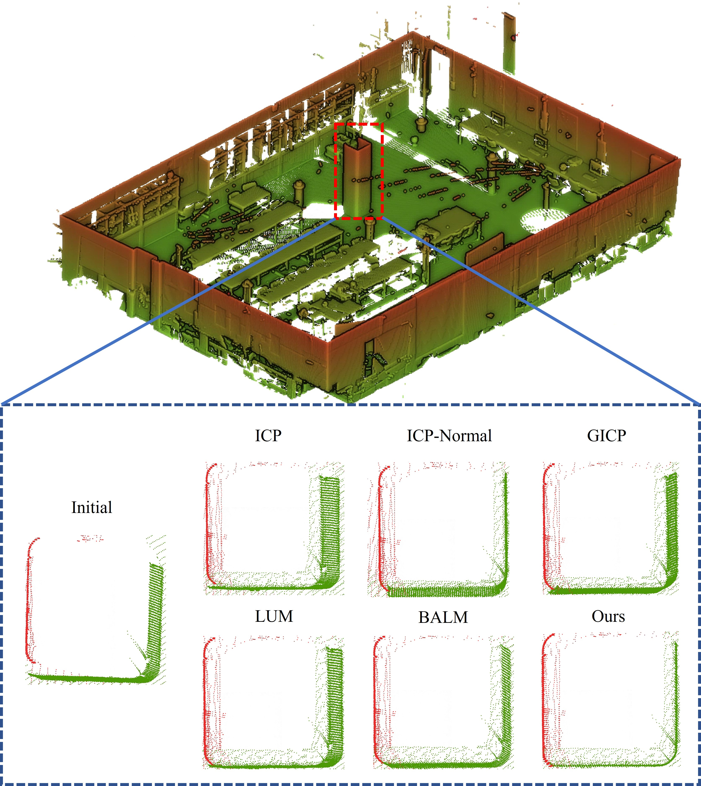

- [EVPA](#evpa)
  - [Code](#code)
  - [Demo](#demo)
  - [How to use](#how-to-use)
    - [1. Pre-requisite](#1-pre-requisite)
    - [2. Compile](#2-compile)
    - [3. run](#3-run)
    - [4. parameter configuration](#4-parameter-configuration)
    - [5. Data preparation](#5-data-preparation)
  - [Contributor](#contributor)
  - [Contact](#contact)


# EVPA
A voxel-based multiview point cloud refinement method via factor graph optimization

Our proposed framework incorporates two innovative designs, namely the **multi-scale voxel-grid optimization strategy** and **the quaternion-based factor graph optimization** that employs a hybrid of point-to-plane and point-to-point factors. 

> * The multi-scale voxel-grid optimization strategy is mainly designed to address the problem that registration is highly non-convex and prone to getting stuck into local minima. 
> * The quaternion-based factor graph optimization refines the pose parameters in the tangent space by two factors, a robust constraint in structured environments provided by point-to-plane factors and a complementary constraint from non-structured surroundings provided by point-to-point factors.



## Code
  The code is currently being refactoring, and will be released as soon as possible.
## Demo






## How to use
The code was tested on Ubuntu 18.04.

### 1. Pre-requisite
   * [ROS](https://wiki.ros.org/melodic/Installation/Ubuntu) melodic
   * [PCL](https://github.com/PointCloudLibrary/pcl) version 1.11.0 (other versions may also work)
   * [ceres](http://ceres-solver.org/installation.html) version 2.10 or above
   * [Eigen](https://eigen.tuxfamily.org/index.php?title=Main_Page) 3.3x or above

### 2. Compile
Clone this repository

```
git clone https://github.com/WuHao-WHU/EVPA.git
cd EVPA
catkin_make
```


### 3. run

```
source ./devel/setup.bash
roslaunch evpa point_cloud_refinement.launch
```
### 4. parameter configuration
All parameter setting can be modified in ``.launch`` file, you can change the default setting regarding different scenarios.

### 5. Data preparation
You can test on the open-source TLS dataset: [WHU-TLS](http://3s.whu.edu.cn/ybs/en/benchmark.htm), [Robotic 3D Scan datasets](http://kos.informatik.uni-osnabrueck.de/3Dscans/), [ETH Dataset](https://prs.igp.ethz.ch/research/completed_projects/automatic_registration_of_point_clouds.html).


The framework supports `*.ply`, `*.pcd` formats of point cloud data. You may need to transform other formats to the supported formats.

## Contributor
[Hao Wu (吴豪)](https://github.com/WuHao-WHU)

## Contact 
Email: haowu2021@whu.edu.cn

Do not hesitate to contact the authors if you have any question or find any bugs.